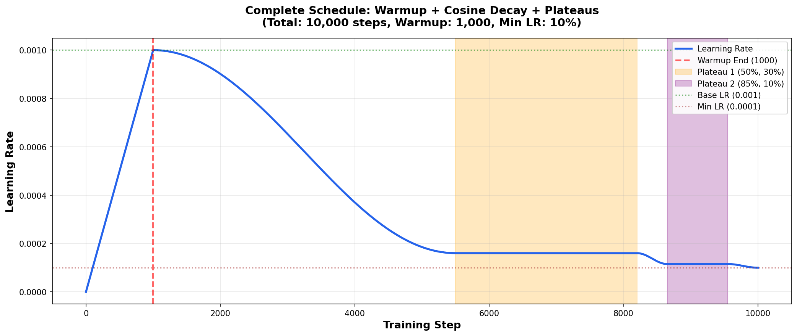
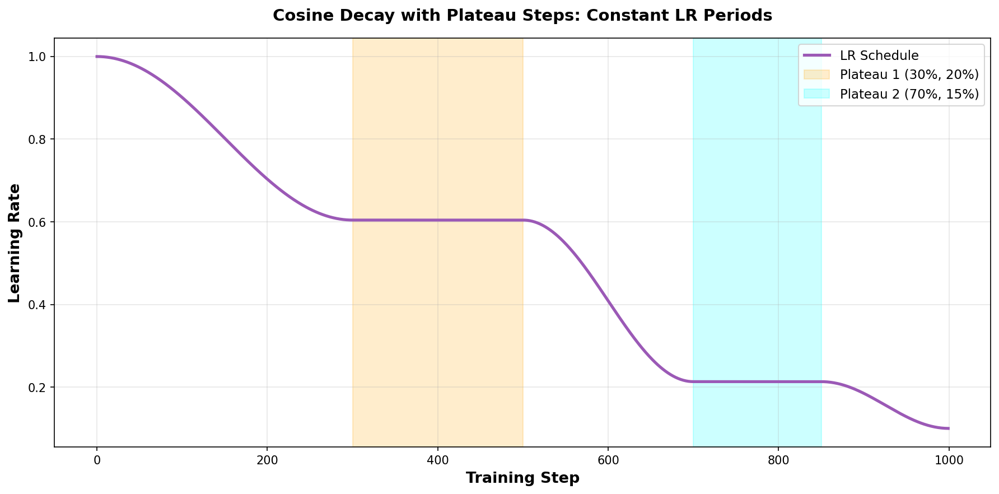

# Cosine Plateau Scheduler

[](https://badge.fury.io/py/cosine-plateau-scheduler)
[](https://opensource.org/licenses/MIT)

An advanced PyTorch learning rate scheduler that combines **cosine annealing**, **warm-up**, and **plateau steps** for optimal training convergence.

## Features

🚀 **Linear Warm-up**: Smooth increase from 0 to base learning rate

📉 **Cosine Annealing**: Proven effective decay following cosine curve with independent segments

🎯 **Plateau Steps**: Maintain constant learning rate at key training intervals for stability

⚙️ **High Performance**: Optimized for minimal overhead (~0.5μs per step)

🔄 **Resume Support**: Continue training from checkpoints with `last_epoch`

⚡ **Scalable**: Tested with millions of training steps

## Requirements

- Python >= 3.7
- PyTorch >= 1.4.0

## Installation

### From PyPI (when published)

```bash
pip install cosine-plateau-scheduler
```

### Directly from GitHub

```bash
pip install git+https://github.com/Koronos/cosine-plateau-scheduler.git
```

### From source (for development)

```bash
git clone https://github.com/Koronos/cosine-plateau-scheduler.git
cd cosine-plateau-scheduler
pip install -e .
```

### Development installation with test dependencies

```bash
pip install -e ".[dev]"
```

## Quick Start

```python
import torch
import torch.nn as nn
from cosine_plateau_scheduler import CosinePlateauScheduler

# Setup model and optimizer
model = nn.Linear(10, 2)
optimizer = torch.optim.Adam(model.parameters(), lr=0.001)

# Create scheduler
scheduler = CosinePlateauScheduler(
    optimizer,
    total_steps=10000,
    warmup_steps=1000,
    min_lr_ratio=0.1,
    plateau_steps=[(50, 30), (85, 10)]
)

# Training loop
for step in range(10000):
    # Your training code
    loss = model(data).sum()
    optimizer.zero_grad()
    loss.backward()
    optimizer.step()
    
    # Update learning rate
    scheduler.step()
```

## How It Works

The scheduler follows a three-phase approach:

### 1. Warm-up Phase
The learning rate increases linearly from 0 to the base learning rate.

### 2. Cosine Annealing
After warm-up, the learning rate follows smooth cosine decay curves between plateaus. Each segment is an independent cosine curve, ensuring smooth transitions.

### 3. Plateau Steps
At specified intervals, the learning rate remains constant for a defined duration. This is useful for:
- Stabilizing training at critical points
- Fine-tuning at specific phases
- Allowing the model to converge at intermediate stages

## Visualization

### Complete Schedule Example

*Full training schedule with warmup, cosine decay, and two plateau regions*

### Plateau Behavior

*Detailed view showing smooth cosine curves between plateau regions*

## Parameters

### Required Parameters

- **`optimizer`** (`Optimizer`): PyTorch optimizer to schedule
- **`total_steps`** (`int`): Total number of training steps

### Optional Parameters

- **`base_lr`** (`float`, optional): Base (maximum) learning rate. If `None`, uses optimizer's initial LR. Default: `None`

- **`min_lr_ratio`** (`float`): Minimum LR as a ratio of base LR. For example, `0.1` means minimum LR will be 10% of base LR. Default: `0.0`

- **`warmup_steps`** (`int`): Number of warm-up steps at the beginning. Default: `0`

- **`plateau_steps`** (`List[Tuple[float, float]]`, optional): List of plateau configurations. Each tuple is `(position%, duration%)`:
  - `position%`: Where the plateau starts (% of post-warmup steps)
  - `duration%`: How long the plateau lasts (% of post-warmup steps)
  
  Example: `[(50, 30)]` means a plateau starting at 50% of training that lasts 30% of the remaining steps.
  
  Default: `None`

- **`last_epoch`** (`int`): The index of the last epoch when resuming training. Default: `-1`

- **`verbose`** (`bool`): If `True`, prints a message for each LR update. Default: `False`

## Examples

### Example 1: Basic Usage with Plateaus

```python
from cosine_plateau_scheduler import CosinePlateauScheduler

scheduler = CosinePlateauScheduler(
    optimizer,
    total_steps=10000,
    warmup_steps=1000,      # 10% warmup
    min_lr_ratio=0.1,       # Min LR = 10% of base LR
    plateau_steps=[
        (50, 30),           # Plateau at 50%, lasts 30%
        (85, 10)            # Plateau at 85%, lasts 10%
    ]
)
```

### Example 2: Simple Cosine with Warm-up (No Plateaus)

```python
scheduler = CosinePlateauScheduler(
    optimizer,
    total_steps=10000,
    warmup_steps=500,
    min_lr_ratio=0.01,
    plateau_steps=None      # No plateaus
)
```

### Example 3: Warm-up with Single Plateau

```python
scheduler = CosinePlateauScheduler(
    optimizer,
    total_steps=10000,
    warmup_steps=1000,
    min_lr_ratio=0.05,
    plateau_steps=[(60, 20)]
)
```

### Example 4: Resume Training from Checkpoint

```python
# Save checkpoint
checkpoint = {
    'epoch': epoch,
    'model_state_dict': model.state_dict(),
    'optimizer_state_dict': optimizer.state_dict(),
    'scheduler_last_epoch': scheduler.last_epoch,
}

# Load and resume
checkpoint = torch.load('checkpoint.pth')
model.load_state_dict(checkpoint['model_state_dict'])
optimizer.load_state_dict(checkpoint['optimizer_state_dict'])

scheduler = CosinePlateauScheduler(
    optimizer,
    total_steps=10000,
    warmup_steps=1000,
    last_epoch=checkpoint['scheduler_last_epoch']
)
```

## Generate Your Own Visualizations

The package includes tools to visualize your learning rate schedule:

```python
# Visualize different configurations
python examples/visualize_scheduler.py

# Generate comprehensive test graphics
python examples/generate_graphics.py
```

## Testing

Run the test suite:

```bash
uv pip install -e ".[dev]"
pytest tests/
```

## Use Cases

This scheduler is particularly effective for:

- **Large-scale training**: Combine warm-up for stability and plateaus for convergence
- **Fine-tuning**: Use plateaus to carefully adjust at critical training stages
- **Long training runs**: Smooth transitions prevent sudden LR changes that can destabilize training
- **Transfer learning**: Warm-up prevents catastrophic forgetting when adapting pretrained models

## Comparison with Other Schedulers

| Feature | CosinePlateauScheduler | CosineAnnealingLR | OneCycleLR |
|---------|------------------------|-------------------|------------|
| Warm-up | ✅ | ❌ | ✅ |
| Cosine Decay | ✅ | ✅ | ✅ |
| Plateau Steps | ✅ | ❌ | ❌ |
| Min LR Control | ✅ | ✅ | Limited |
| Independent Segments | ✅ | ❌ | ❌ |
| High Performance | ✅ (~0.5μs) | ✅ | ✅ |

## Algorithm Details

The learning rate at step \( t \) is calculated as:

**Warm-up phase** (\( t < t_{warmup} \)):
- Linear: \( lr(t) = lr_{base} \cdot \frac{t}{t_{warmup}} \)
- Cosine: \( lr(t) = lr_{base} \cdot f_{cosine}(t) \) where \( f_{cosine} \) provides smooth transition

**Training phase** (\( t \geq t_{warmup} \)):
- If in plateau: \( lr(t) = lr_{plateau} \) (constant)
- Otherwise: \( lr(t) = lr_{min} + (lr_{base} - lr_{min}) \cdot \frac{1 + \cos(\pi \cdot \frac{t_{eff}}{T_{eff}})}{2} \)

Where:
- \( t_{eff} \) = effective step (excluding plateau durations)
- \( T_{eff} \) = total training steps minus plateau durations
- \( lr_{min} = lr_{base} \cdot min\_lr\_ratio \)

## Contributing

Contributions are welcome! Please feel free to submit a Pull Request.

## License

This project is licensed under the MIT License - see the LICENSE file for details.

## Citation

If you use this scheduler in your research, please cite:

```bibtex
@software{cosine_plateau_scheduler,
  author = {Koronos},
  title = {Cosine Plateau Scheduler: Advanced Learning Rate Scheduling for PyTorch},
  year = {2025},
  url = {https://github.com/Koronos/cosine-plateau-scheduler}
}
```

## Acknowledgments

Inspired by various successful training strategies in deep learning research, including:
- Cosine Annealing (Loshchilov & Hutter, 2016)
- Warm-up strategies (Goyal et al., 2017)
- Plateau-based scheduling techniques

## Support

For issues, questions, or suggestions, please [open an issue](https://github.com/Koronos/cosine-plateau-scheduler/issues) on GitHub.

